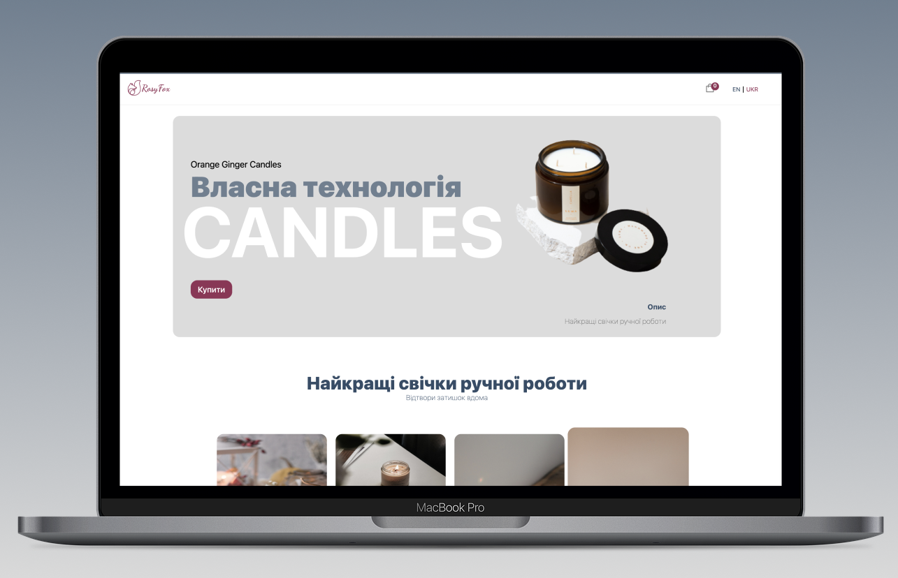

## Welcome to RosyFox Candles E-commerce Website by Mariia Matviian

RosyFox Candles is an e-commerce website built using React, Next.js, and Sanity. It offers a seamless shopping experience for users, providing a user-friendly interface to browse and purchase handmade candles.

## Key Features

- User-Friendly Interface: Enjoy a smooth and intuitive shopping experience with an easy-to-use interface.
  

- Admin Page: Manage your site's content, orders, and statistics through the secure admin page.
- Data Storage with Sanity: The website utilizes Sanity, a flexible and scalable content management system, to store and manage structured data.

## Tech Stack

- React: A popular JavaScript library for building user interfaces
- Next: A framework for server-side rendering with React
- Sanity: A content management system for managing structured data
- MongoDB: a database to store credentials

This project utilizes Next.js, a powerful framework that enables server-side rendering and optimizes performance to deliver fast and responsive web pages. The integration with Sanity Studio allows you to effortlessly manage the content of your website, including adding or removing items and updating information.

For enhanced security and privacy, the project incorporates a secure admin page that is protected by password authentication and token-based authorization. This admin page enables you to manage orders and access valuable statistics to gain insights into your e-commerce operations.

To provide a personalized experience for users, the website supports internationalization with English and Ukrainian translations. This ensures that visitors can interact with the site in their preferred language, creating a more engaging and inclusive environment.
